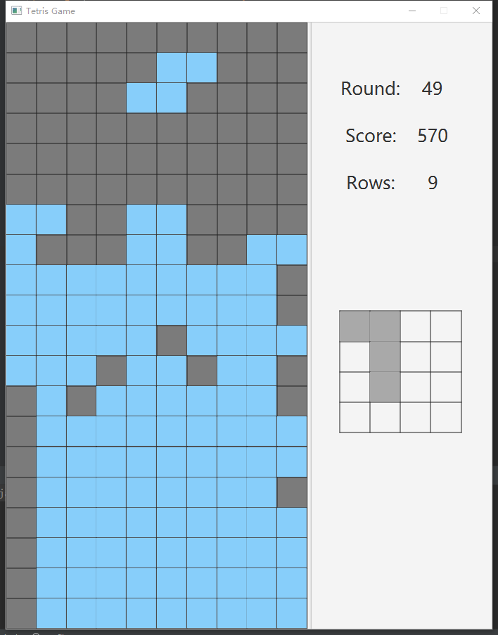
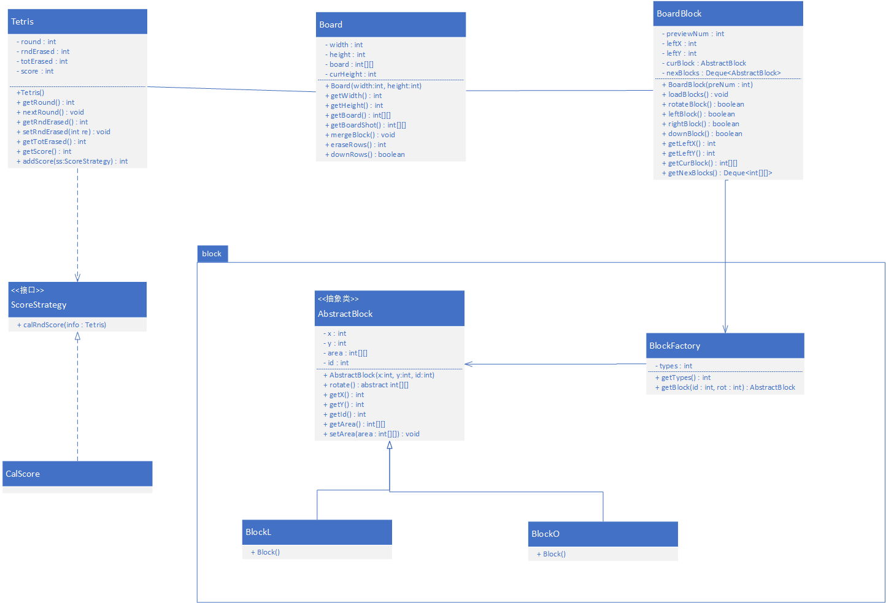

# TetrisGame
This is the Tetris game  implemented by Java1.8 (or later) and JavaFx UI Library .

[https://github.com/GuangyuPeng/TetrisGame/tree/master](https://github.com/GuangyuPeng/TetrisGame/tree/master)

## Tetris UI

## Class Diagram

This is the UML class diagram of domain layer.

## Enjoy yourself

Welcome all suggestions for improvement ! ! !

